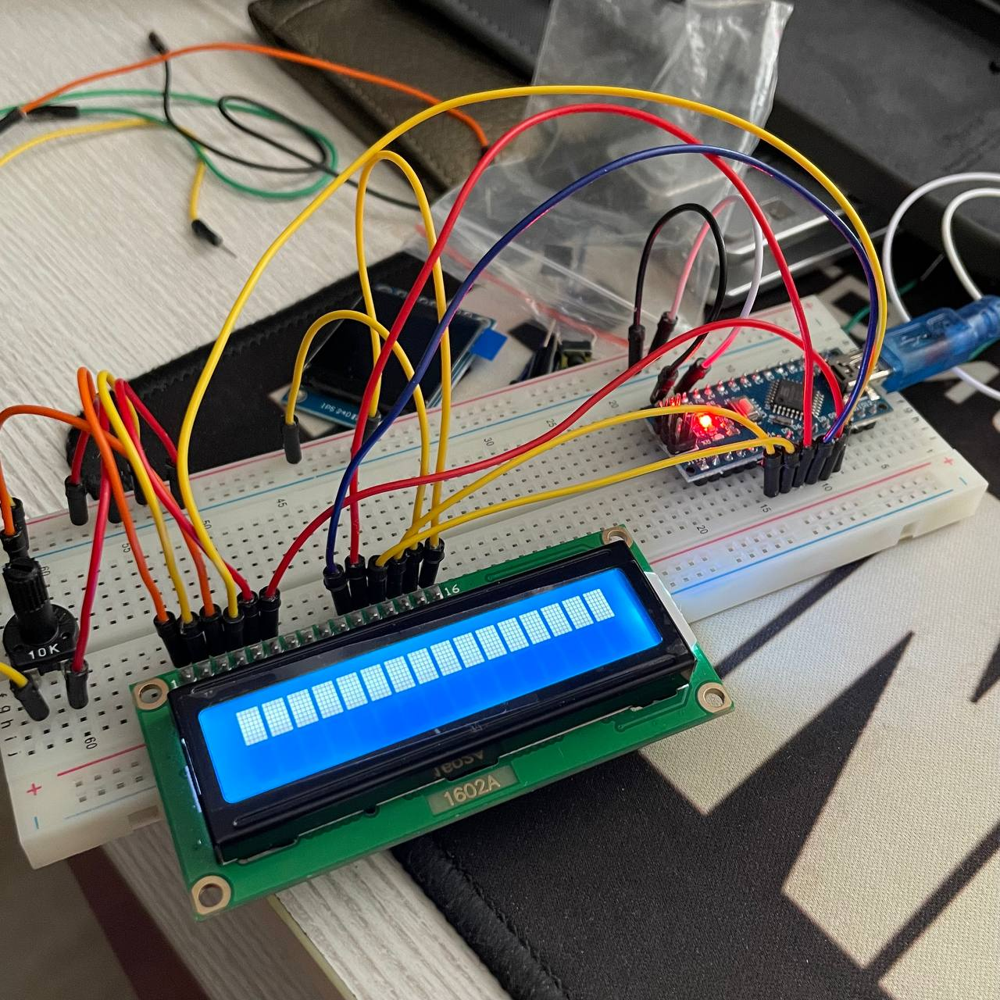
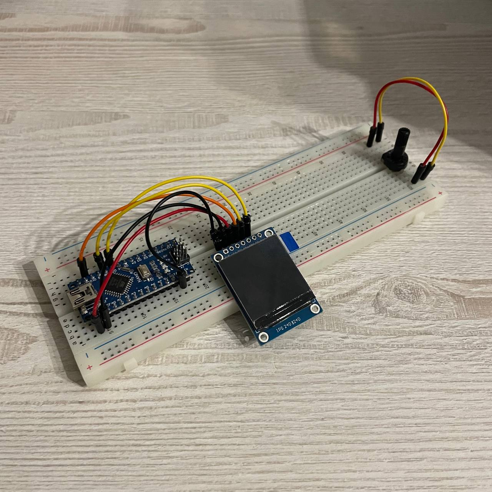
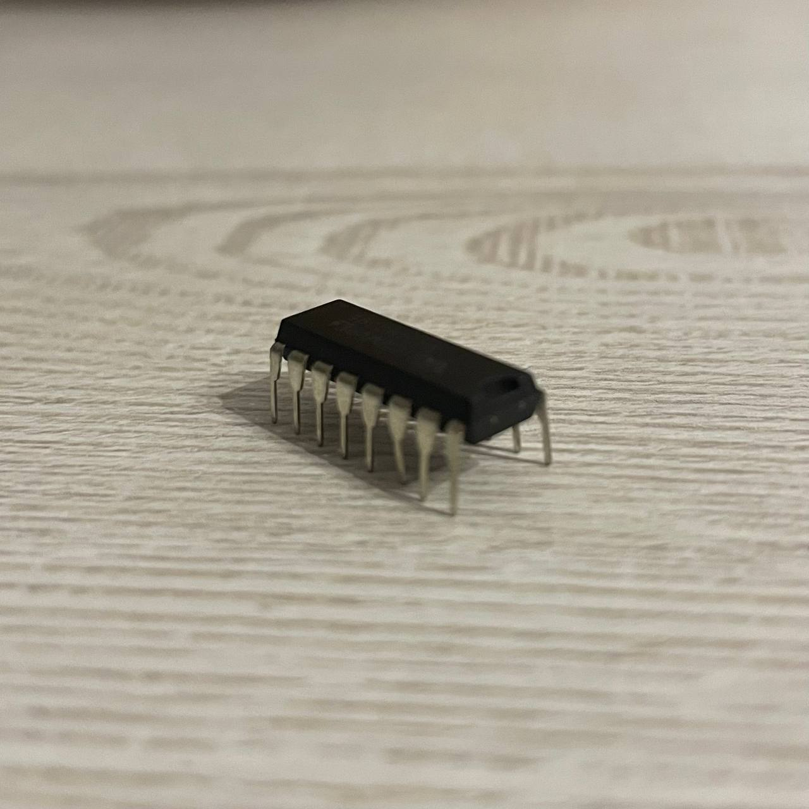
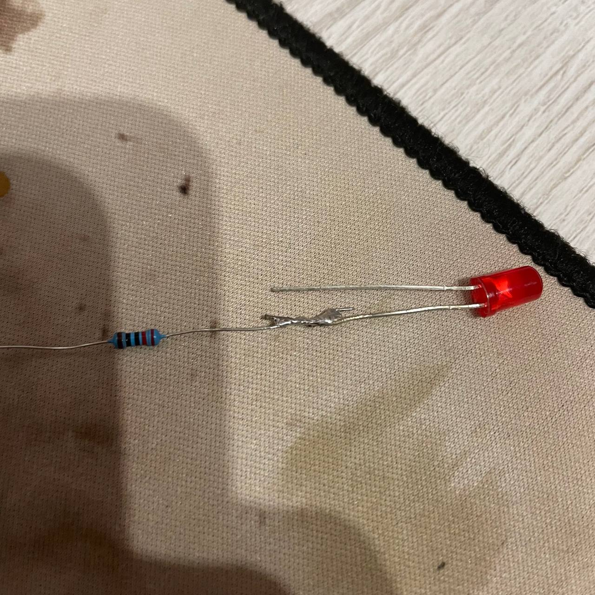
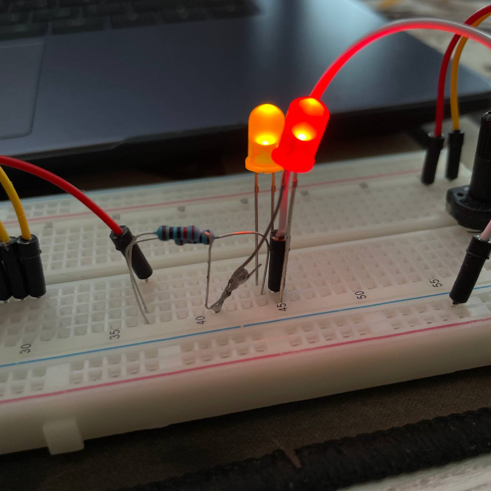

# Грамотный ценник 🏷️

## Мотивация и цель

Частенько случается, что берешь в магазине печеньки по одной цене, а на кассе узнается, что стоимость иная, к сожалению, в большинстве случаев не в сторону покупателя. 

Умный или грамотный ценник не является человеком, поэтому у него нет проблем быстро изменить цену и сразу уведомить об этом покупателей. В итоге все в плюсе: магазину не придется следовать закону и продавать товар по заниженной цене, а покупатель берет товар по актуальным ценам (*на кассе не нужно будет ждать, пока Люда отменить позицию в чеке*).

У нас есть жгучее желание решить эту проблему, а также поработать с Arduino (мониторчиком, wi-fi модулем) и написать клиент-серверное приложение на C/C++.

## Техническое задание

При первом включении бэкенд распределит ценники на мониторы случайным образом. После, все экраны будут уже пронумерованы и пользователь сможет изменять данные на конкретном экране в клиентском приложении. 

В клиентском приложении пользователю доступен удобный импорт товаров в систему (*например, из .csv файла*) для слияния и добавления с текущими позициями, или же полной замены всех наименований. Также доступна возможность редактирования единичных товаров: изменения цены, наименования.

По нажатию в клиентском приложении на кнопку все ценники установятся на выбранные экранчики. Все сигналы, которые отправит сервер, примет wi-fi модуль, а данные отобразятся на экране.

Подразумевается модульная система монтажа ценников, то есть быстрое добавление нового экрана, а также его демонтаж.

## Зависимости и технологии

- **Платформа Arduino** - OLED I2C, ESP8266
- **Boost.Asio** - сервер
- **Telegram Bot API** - интерфейс для обновления цен
- **MySQL**

## Команда

Александр Виноградов - сервер, Arduino

Алексей Косенко - Arduino

Роман Гостило - клиент, сервер

## Контрольный пункт 4

В ценнике самое важное - ~~дешевизна~~ как он выглядит, он же <u>лицо товара</u>, он же <u>исчерпывающая информация</u> для покупателя. Изначально предполагалось в целях экономии взять дешевый жидкокристалический экран `LCD1602`. После первого подключения стало ясно, что безумно синий экран с плохим углами обзора - **никуда не годится**. После недолгих раздумий был найден экран в _плюс-минус_ такой же ценовой категории - `IPS ST7735`, квадратный мониторчик со стороной 240 пикселей. 

<table style="table-layout: fixed; width: 100% ; border-collapse: collapse ; border-width: 0px 0px 0px 0px;">

<tr>
    <td style="width: 50% ;">
        
    </td>
    <td>
        
    </td>
</tr>
<tr>
    <td style="color: grey;">LCD1602</td>
    <td style="color: grey;"> IPS ST7735 </td>
</tr>
</table>

<table>
<tr>
    <td style="width: 50%;">
        
    </td>
    <td style="width: 50%;">
        <span>
            Возникает вопрос о заявленной <b>модульности системы</b>. Обратим внимание, что на платформе Arduino <u>всего 13 ножек</u>, на которых можно вести управление устройствами. Один монитор <u>занимает 4 разъема</u>, что делать если на полке будет десять и более ценников? Ещё же добавиться модуль Wi-Fi? Тут нам поможет сдвиговый регистр <code>74HC595</code>, который прост в использовании и монтаже. 
        </span>
        <br/>
        <br/>
        <span>
            Настал момент паять, но Алексей в жизни не держал паяльник. Паять действительно уже нужно, так как у монитора не припаяны ножки. Сейчас вся установка расположена на <code>breadboard</code>, а мониторчик <i>божьим чудом</i> передает данные без крепления.  
        </span>
    </td>
</tr>
</table>

<table>
<tr>
    <td style="width: 50%;">
        
    </td>
    <td style="width: 50%;">
        
    </td>
</tr>
<tr>
    <td style="color: grey;">Припаял бедняге-светодиоду на ножку-анод резистор на 220 Ом</td>
    <td style="color: grey;">По нему действительно течет ток! Первая криво-успешная пайка! </td>
</tr>
</table>

> Со всеми datasheets устройств, которые были/будут упомянуты, ответственный человек (_Алексей_) ознакомлен. Также найдены хорошие обертки (_библиотеки_), но, скорее всего, все будет писаться самостоятельно, так сказать в учебных целях, да и в экономии лишних байтиков на платформе.

## Контрольный пункт 5

##### Бот

Был быстренько написан бот на Go для обновления цен на ценниках. Был выбран Go, потому что бот вроде никакого отношения к АКОСу не имеет, никакой осмысленной логики не содержит и важной частью проекта не является. Но, если это принципиально, может быть переписан на C++.

Взаимодействие с ботом осуществляется посредством команды

```
/setprice *артикул товара* *цена* 
```

Бот уже развёрнут на Yandex.Cloud и готов к интеграции в бэкенд.
